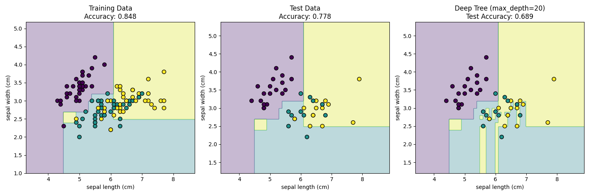

# AI and ML

## Solving the XOR problem

In [neuralnet_from_scratch.py](./neuralnet_from_scratch.py) I implemented a Neural Network from scratch to solve the XOR problem. The neural network consists in two layers and uses the $\tanh$ activation function.

### Output

```
XOR Problem:
Inputs:
 [[0 0]
 [0 1]
 [1 0]
 [1 1]]
Targets:
 [[0]
 [1]
 [1]
 [0]]

This is NOT linearly separable - you can't draw a line to separate them!
------------------------------------------------------------

Initialized weights:
W1 shape: (4, 2)
b1 shape: (4, 1)
W2 shape: (1, 4)
b2 shape: (1, 1)
------------------------------------------------------------

Starting training...
Epoch 0, Loss: 0.693187
Epoch 1000, Loss: 0.000000
Epoch 2000, Loss: 0.000000
Epoch 3000, Loss: 0.000000
Epoch 4000, Loss: 0.000000
Epoch 5000, Loss: 0.000000
Epoch 6000, Loss: 0.000000
Epoch 7000, Loss: 0.000000
Epoch 8000, Loss: 0.000000
Epoch 9000, Loss: 0.000000

Training complete!
------------------------------------------------------------

Testing on XOR inputs:
Input: [0 0], True: 0, Predicted: 0.0000
Input: [0 1], True: 1, Predicted: 1.0000
Input: [1 0], True: 1, Predicted: 1.0000
Input: [1 1], True: 0, Predicted: 0.0000
```


## Classifying Iris Flowers: Decision Tree

In [dectree_from_scratch.py](./dectree_from_scratch.py) I implemented Decision Tree algorithm from scratch to classify species of Iris flowers, using the (classic) Iris dataset. I use *Gini impurity* to estimate the nodes purity (information gain).

### Output
```
Loading Iris dataset...
Training samples: 105
Test samples: 45
Features: ['sepal length (cm)', 'sepal width (cm)']
Classes: ['setosa' 'versicolor' 'virginica']
------------------------------------------------------------

Training decision tree...

Tree structure:
Split: feature_0 <= 5.40
Left:
  Split: feature_1 <= 2.70
  Left:
    Split: feature_0 <= 4.50
    Left:
      Leaf: class=0
    Right:
      Split: feature_0 <= 4.90
      Left:
        Split: feature_1 <= 2.40
        Left:
          Leaf: class=1
        Right:
          Leaf: class=2
      Right:
        Leaf: class=1
  Right:
    Split: feature_0 <= 5.30
    Left:
      Leaf: class=0
    Right:
      Split: feature_1 <= 3.00
      Left:
        Leaf: class=1
      Right:
        Leaf: class=0
Right:
  Split: feature_0 <= 6.10
  Left:
    Split: feature_1 <= 3.20
    Left:
      Split: feature_0 <= 5.70
      Left:
        Split: feature_0 <= 5.50
        Left:
          Leaf: class=1
        Right:
          Leaf: class=1
      Right:
        Split: feature_1 <= 3.00
        Left:
          Leaf: class=1
        Right:
          Leaf: class=1
    Right:
      Leaf: class=0
  Right:
    Split: feature_1 <= 2.50
    Left:
      Leaf: class=1
    Right:
      Split: feature_0 <= 7.00
      Left:
        Split: feature_1 <= 3.20
        Left:
          Leaf: class=2
        Right:
          Leaf: class=2
      Right:
        Leaf: class=2
------------------------------------------------------------

Train Accuracy: 0.848
Test Accuracy: 0.778
Accuracy Gap: 0.070
✅ Good generalization!
------------------------------------------------------------
```



## Classifying Iris Flowers: Random Forest

In [ranforest_from_scratch.py](./ranforest_from_scratch.py) I implemented a random forest from scratch.