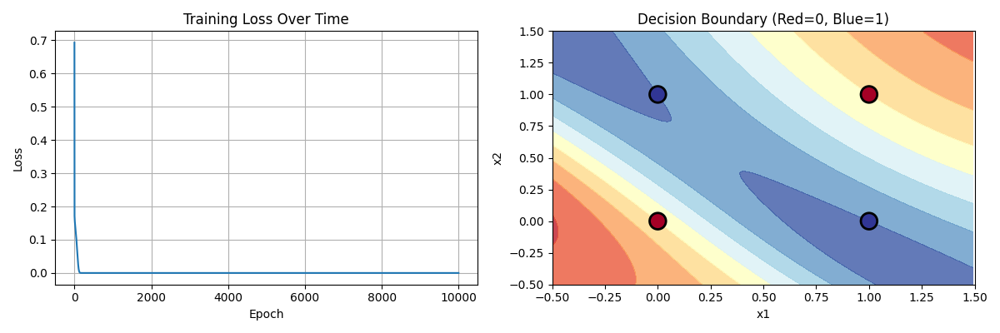

# Neural Networks

## Solving the XOR problem

In [xor_from_scratch.py](./xor_from_scratch.py) I implemented a Neural Network from scratch to solve the XOR problem. The neural network consists in two layers and uses the $\tanh$ activation function.

### Output

```
XOR Problem:
Inputs:
 [[0 0]
 [0 1]
 [1 0]
 [1 1]]
Targets:
 [[0]
 [1]
 [1]
 [0]]

This is NOT linearly separable - you can't draw a line to separate them!
------------------------------------------------------------

Initialized weights:
W1 shape: (4, 2)
b1 shape: (4, 1)
W2 shape: (1, 4)
b2 shape: (1, 1)
------------------------------------------------------------

Starting training...
Epoch 0, Loss: 0.693187
Epoch 1000, Loss: 0.000000
Epoch 2000, Loss: 0.000000
Epoch 3000, Loss: 0.000000
Epoch 4000, Loss: 0.000000
Epoch 5000, Loss: 0.000000
Epoch 6000, Loss: 0.000000
Epoch 7000, Loss: 0.000000
Epoch 8000, Loss: 0.000000
Epoch 9000, Loss: 0.000000

Training complete!
------------------------------------------------------------

Testing on XOR inputs:
Input: [0 0], True: 0, Predicted: 0.0000
Input: [0 1], True: 1, Predicted: 1.0000
Input: [1 0], True: 1, Predicted: 1.0000
Input: [1 1], True: 0, Predicted: 0.0000
```

